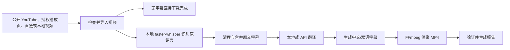

# YouTube Chinese Localization Pipeline 中文使用说明书

本说明书面向希望在 Windows 10/11 上将英文视频制作成简体中文本地化版本的普通用户。

项目地址：

<https://github.com/lujiangyancheng-jpg/youtube-chinese-localization-pipeline>

## 1. 软件能做什么

输入一个公开的 YouTube 视频链接、公开声明视频地址且你有权下载的播放页、直接媒体地址，或本地视频文件，软件可以生成：

- 原始视频的安全副本、公开 YouTube 视频下载文件或直接媒体下载文件
- 可选“仅下载原视频（无字幕）”，直接保存最高画质与最高质量音频的合并文件
- 规范化的英文 SRT 字幕
- 简体中文 SRT 字幕
- 可选的中英双语字幕
- 带硬字幕的 MP4 视频
- 字幕预览片段
- 标题、简介和标签草稿
- 可恢复的项目目录、日志和处理报告

处理流程如下：



## 2. 使用前必须确认

只能处理以下内容：

- 你自己拥有的视频
- 公共领域内容
- 许可范围允许翻译和转载的 Creative Commons 内容
- 已取得明确翻译和再发布许可的内容

本软件不会绕过 DRM、付费墙、私人视频权限、年龄限制、地区验证或平台登录控制。网页解析只读取标准 HTML 中公开声明的媒体地址，不执行或反混淆脚本、不递归抓取 iframe、不读取浏览器 Cookie，也不使用登录凭据。

发布前请自行核实：

- 授权是否允许翻译、修改和重新发布
- 是否需要署名原作者
- 是否允许商业用途
- 发布平台是否有额外规则

## 3. Windows 快速安装

### 3.0 推荐：离线安装包

下载 `YouTube-Chinese-Localizer-0.7.0.8-Standard-Offline-Setup.exe` 后直接双击安装即可。Standard 已是单文件安装包，
不再需要额外的 `.bin`。它包含 Python、精简 FFmpeg、字幕字体和两套快速翻译模型；
安装过程会出现“选择本地模型”页，可按需勾选 Whisper Small（多数电脑推荐）、Whisper Medium（更高识别质量）
和本地 AI 段落翻译所需的 Qwen3:4b 与 Ollama。安装器只会下载所勾选的组件并逐个校验 SHA-256；未勾选的
模型不会下载或占用磁盘。若电脑暂时不联网，可不勾选模型，之后从兼容模型 Release 下载安装独立模型包。四段版本号的最后一段是程序迭代号，例如 `0.7.0.8` 继续使用 `0.7.0` 模型包。

### 3.0.1 添加播放器媒体直链

如果内容方的播放器已提供完整的视频地址，点击主界面顶部“媒体直链”，粘贴 MP4、WebM、M3U8、MPD 或无扩展名 CDN 地址。可一行添加一条，验证后它们会进入普通任务队列。

注意：

- 必须粘贴完整地址；播放器调试文字中以 `…` 结尾的截断显示无法使用。
- 带时间签名的地址可能在几分钟或几小时后过期；重新复制最新地址并保留“继续上次处理”即可恢复。
- HTTP 401/403 通常表示地址已过期，或依赖浏览器的登录、Cookie 或 Referer。软件不会导入这些凭据或绕过站点控制。
- 直链仍需是你有权保存的公开媒体，且不能受 DRM 保护。

### 3.0.2 从动态播放页自动抓取媒体地址

对于通过 JavaScript 或第三方播放器动态加载视频的页面，点击主界面顶部“浏览器抓取”，粘贴一个播放页地址并开始。程序会打开使用全新临时配置的 Microsoft Edge；在该窗口中让目标视频开始播放，程序检测到播放器当前的完整 HTTP(S) 地址后，会自动关闭抓取窗口、替换原播放页并读取画质信息。预分析发现 Cloudflare 或动态播放器时也会自动进入此流程。如果你已点击“开始本地化”，抓取成功并验证新地址后会自动继续原任务，无需再点第二次开始。

浏览器抓取只观察媒体 URL：

- 不连接或读取日常 Edge 配置、Cookie、登录状态、密码和浏览记录；
- 不保留 Authorization、Referer 等请求头，也不读取媒体响应正文；
- 需要验证码或浏览器挑战时必须由用户亲自完成；
- 不处理 DRM、付费、登录、地区或内容权限限制；
- 只接受解析为公网地址的 HTTP(S) 播放页和媒体 URL；
- 抓取窗口关闭后会清理独立临时配置。

如果捕获的签名 URL 已过期，重新执行一次“浏览器抓取”即可刷新地址，并继续使用项目断点续跑。

启动软件后不会自动弹出教程。需要帮助时点击主界面的“帮助中心”：其中的“快速开始”说明完整流程，“环境与模型”显示 Whisper、本地 AI、性能调度和输出磁盘状态，“常见问题”提供限流、显存、磁盘与字幕压制失败的恢复方法。缺少模型时，该页面会打开前三段兼容的模型 Release，而不是错误地跳到不含模型的程序小迭代页面。

正式版安装后，可在开始菜单运行“Verify YouTube Localizer Installation”。它会核验随安装包提供的
模型和字体大小及 SHA-256 哈希，再检查图形界面与本地模型能否加载；此快速核验不会运行较慢的 Qwen
推理。

下面 3.1–3.6 是从 GitHub 源码手动安装时才需要的步骤。

### 3.1 安装 Git

如果电脑尚未安装 Git：

```powershell
winget install Git.Git
```

安装完成后重新打开 PowerShell。

### 3.2 下载项目

```powershell
git clone https://github.com/lujiangyancheng-jpg/youtube-chinese-localization-pipeline.git
cd youtube-chinese-localization-pipeline
```

### 3.3 安装 Python

建议使用 Python 3.11、3.12 或 3.13。安装时勾选“Add Python to PATH”。

可以使用：

```powershell
winget install Python.Python.3.12
```

### 3.4 安装 FFmpeg

```powershell
winget install Gyan.FFmpeg
```

安装后关闭并重新打开 PowerShell，然后检查：

```powershell
ffmpeg -version
ffprobe -version
```

FFmpeg 必须包含 `ass`/`subtitles`（libass）字幕滤镜。

如果不希望加入系统 PATH，也可以把 FFmpeg 放在：

```text
项目目录\tools\ffmpeg\bin\ffmpeg.exe
项目目录\tools\ffmpeg\bin\ffprobe.exe
```

### 3.5 创建 Python 虚拟环境

```powershell
py -3.12 -m venv .venv
.\.venv\Scripts\Activate.ps1
python -m pip install --upgrade pip
python -m pip install -e ".[transcription,offline-translation]"
```

### 3.6 检查环境

```powershell
python main.py doctor
```

理想结果：

- Python：`ok`
- FFmpeg：`ok`
- ffprobe：`ok`
- yt-dlp：`ok`
- yt-dlp JavaScript support：`ok`（Deno 与 yt-dlp-ejs 均已安装）
- faster-whisper：`ok` 或 `optional`
- Offline translation runtime：`ok`
- Offline English→Chinese model：离线安装包中应为 `ok`
- Offline Chinese-to-English model：离线安装包中应为 `ok`
- 输出目录：`ok`
- 中文字体：`ok` 或可接受的警告

### 3.7 双击打开“粘贴链接”界面

新版桌面界面采用简洁的下载器式布局：“粘贴链接”是顶部最醒目的主操作，
尚未添加视频时只显示两步提示；粘贴后才出现当前任务、授权确认和开始按钮。一次复制多行
链接也可以：每行一个链接，程序会把它们加入安全队列。任务中心会在后台读取每个视频的标题、时长、
分辨率、帧率和预估下载大小；这一步不会下载视频，也不会开始正式处理。预分析暂时失败不代表下载一定
失败，仍可直接开始尝试。预分析与正式处理共享短期缓存，避免开始后立即重复检查同一来源；缓存不会保留带签名直链的查询参数。程序会根据逻辑 CPU 和系统内存自动启用 1–4 个下载／预处理任务，Whisper、
本地 AI 与压制阶段会自动排队，并在每一项之间保留断点续跑。
处理设置、API 参数与运行记录均按需展开，避免第一次使用时被大量选项干扰。

安装和环境检查完成后，在项目目录中双击：

```text
Start Localizer.cmd
```

打开窗口后：

1. 复制并粘贴一个你有权处理的公开 YouTube 视频链接、公开 HTML5 播放页或直接媒体地址，也可以选择本地视频。
2. 如果需要字幕，选择“英文 → 简体中文”或“简体中文 → 英文”。
3. 选择“仅下载原视频（无字幕）”、仅目标语言字幕或中英双语字幕。
4. 如果需要字幕，软件会统一使用内置的 Noto Sans CJK SC 字体；按需要选择小号、标准、大号或超大字幕字号。
5. 如果需要字幕，选择翻译方式；然后确认授权。
6. 点击“开始本地化”。

任务开始后，每一行都会独立显示当前阶段和进度；下载阶段还会显示实时速度和剩余时间。处理前可选中一行并点击“移除所选”；运行中可以只“暂停所选”，不影响其他项目。暂停或失败后可“继续所选”，也可以恢复整批未完成任务。项目创建后可点击
“打开项目”直接查看这一项的 `source`、`subtitles`、`rendered` 和 `logs`；生成最终 MP4 后可点击“打开成片”。运行期间输入区会暂时锁定，
防止误粘贴或修改导致任务状态错位。

任务中心会原子保存输入、标题、媒体摘要、状态、进度和项目路径。正常关闭、意外退出或电脑重启后再次打开软件，队列会自动恢复；原本处于分析、排队或运行状态的项目会显示为“已暂停，可继续”，不会错误宣称仍在后台运行。API Key 不会写入队列文件。整批完成、部分失败、暂停或停止时，Windows 任务栏会闪烁并发出系统提示音。

软件会记住翻译方向、字幕／下载模式、翻译方式、字幕字号和位置、输出画质、帧率、分辨率、输出目录、
更新通道和断点续跑设置。它们只保存在当前 Windows 用户的本机设置目录中；API Key 不会写入该设置文件。
如果设置文件损坏或来自不兼容的旧版本，软件会自动使用安全默认值启动。

在“调整处理设置”里点击“预览并调整字幕”，可打开 16:9 布局预览。直接拖动字幕框可调整位置，拖动右下角绿色控制点可自由调整字号；点击“应用到任务”后，位置和字号会写入最终 ASS 字幕与压制视频。预览不下载视频，也不会开始处理任务。

窗口会实时显示下载、Whisper 本地转录、翻译和视频压制进度。点击“打开输出文件夹”可以查看处理项目。英译中和中译英的最终视频分别位于：

```text
output\项目名称\rendered\chinese_hardsub.mp4
output\项目名称\rendered\english_hardsub.mp4
```

翻译方式说明：

- “仅下载原视频（无字幕）”始终使用最高画质视频和最高质量音频并自动合并，完成后直接停下，不运行 Whisper、翻译或字幕压制；文件位于项目的 `source` 文件夹。
- “免费模式”不需要 API，会自动完成视频下载和原语言字幕，然后停在人工翻译步骤。
- “本地快速翻译并压制”不需要 API，会使用约 85 MB 的轻量模型在本机完成翻译。它现在会先合并完整段落再翻译，适合速度优先或配置较低的电脑。
- “本地 AI 段落翻译并压制”是推荐的高质量无 API Key 模式。Standard 安装时勾选本地 AI，或安装前三段兼容的 Local AI 模型包后，即可获得 Ollama 和 `qwen3:4b`；Complete 离线包也已内置。它会先理解并翻译完整段落，再由程序按目标语言标点重新切成自然字幕；字幕文本只发送到本机 `localhost`。
- 两种本地翻译都会应用 `glossary.yaml` 中的术语。
- “自动翻译并压制字幕”会继续生成目标语言字幕并压制最终视频，但必须填写 OpenAI-compatible 接口地址、模型名称和 API Key。
- 在窗口中输入的 API Key 只传给处理进程，不会保存到项目或上传到 GitHub。接口地址和模型名称可能写入本地项目的已解析配置，以便中断后继续处理。

### 3.3 其他语种（本地 AI 或 API）

现在可把英文或简体中文字幕翻译为日语、韩语、西班牙语、法语、德语、葡萄牙语、俄语或阿拉伯语。选择这些方向后，窗口只保留“本地 AI 段落翻译并压制”和“自动翻译并压制字幕”两项：前者需要在 Standard 安装时勾选本地 AI、安装前三段兼容的 Local AI 模型包，或使用 Complete 包中的本地 Ollama/Qwen 模型；后者需要填写 OpenAI-compatible API。

快速离线模型、人工翻译流程和中英双语字幕排版仅用于中英互译，因此不会在这些语种方向中出现。其他语种使用“仅目标语言字幕”，例如西班牙语会生成 `subtitles/es.srt`、`subtitles/es.ass` 和 `rendered/es_hardsub.mp4`。

新版已取消“使用 YouTube 字幕”选项。无论链接是否提供字幕，程序都只下载视频/音频，再用本地 Whisper 识别英文或中文。

公开播放页优先从标准 HTML5 `<video>`/`<source>`、Open Graph、Twitter Card 或 VideoObject JSON-LD
读取媒体地址。程序最多读取 2 MiB HTML、跟随 5 次经过公网校验的重定向，并阻止 localhost、局域网与
保留地址。动态页面或 Cloudflare 浏览器验证会切换到使用全新临时配置的 Edge 抓取，由用户亲自完成验证并
开始播放；软件只接收播放器的公开 HTTP(S) 媒体 URL，不导入 Cookie、登录状态或请求头，也不绕过 DRM、
付费、登录、地区或内容权限。

直接媒体地址仍可使用：例如以 `.mp4`、`.webm`、`.mov`、`.mkv`、`.m3u8` 或 `.mpd` 结尾的公开链接；
没有后缀的 CDN 直链也可以，只要服务器响应明确标识为视频/HLS/DASH。
带临时签名的链接失效时，重新取得同一文件的新直链、粘贴后勾选“断点续跑”即可刷新下载地址。

ChatGPT Plus 不能直接作为本地程序的 API 使用，也不包含 OpenAI API 额度。

## 4. 第一次处理本地视频

先用一段你拥有版权的短视频测试：

```powershell
python main.py process "D:\Videos\owned-demo.mp4"
```

也可以省略 `process`：

```powershell
python main.py "D:\Videos\owned-demo.mp4"
```

默认使用不需要 API Key 的人工翻译模式。第一次运行通常会：

1. 检查并复制视频
2. 调用本地 faster-whisper 转录原语言
3. 生成统一的原文时间轴
4. 清理英文字幕
5. 导出人工翻译分块
6. 显示项目目录并等待翻译导入

请不要关闭或删除生成的项目目录。后续步骤会继续使用该目录。

## 5. 人工 ChatGPT 翻译流程

这是默认并且不产生 API 费用的流程。

> ChatGPT Plus 与 OpenAI API 是两项独立服务。ChatGPT Plus 不包含 OpenAI API 额度。

### 5.1 找到翻译分块

程序会生成类似目录：

```text
output\Owned demo_a1b2c3d4e5\
  subtitles\
    english.cleaned.srt
    translation_chunks\
      chunk_001.md
      chunk_002.md
      manifest.json
```

### 5.2 在 ChatGPT 中翻译

逐个上传 `chunk_001.md`、`chunk_002.md`。

文件已经包含翻译规则。ChatGPT 应返回 JSONL，每一行类似：

```json
{"id":1,"start":"00:00:01,000","end":"00:00:03,000","en":"Hello everyone","zh":"大家好"}
```

请保存每次返回的内容，例如：

```text
D:\Translations\translated_chunk_001.txt
D:\Translations\translated_chunk_002.txt
```

不要修改：

- `id`
- `start`
- `end`
- `en`

只填写 `zh`。

### 5.3 导入翻译

```powershell
python main.py translate-import "output\Owned demo_a1b2c3d4e5" "D:\Translations\translated_chunk_001.txt"
python main.py translate-import "output\Owned demo_a1b2c3d4e5" "D:\Translations\translated_chunk_002.txt"
```

每次导入都会显示：

```text
Imported translations: 已导入数量/总字幕数量
```

全部完成后会生成：

```text
subtitles\chinese.srt
subtitles\chinese.ass
```

### 5.4 渲染最终视频

```powershell
python main.py render "output\Owned demo_a1b2c3d4e5"
```

最终文件：

```text
rendered\chinese_hardsub.mp4
```

### 5.5 验证输出

```powershell
python main.py validate "output\Owned demo_a1b2c3d4e5"
```

验证会检查：

- 字幕编号和时间是否合法
- 视频流是否存在
- 音频流是否存在
- 输出时长是否接近源视频
- 视频是否可以解码

## 6. 处理公开 YouTube 视频或直接媒体地址

确认你有权翻译和再发布后运行：

```powershell
python main.py process "https://www.youtube.com/watch?v=VIDEO_ID"
```

字幕来源固定为本地 `faster-whisper-medium`。程序不会请求、下载或使用
YouTube 的作者字幕和自动字幕，因此原文时间轴在不同链接上保持同一套
本地识别规则。

完全不使用 API 的一站式命令：

```powershell
python main.py process "https://www.youtube.com/watch?v=VIDEO_ID" `
  --translation-provider offline
```

更自然的本地 AI 段落翻译（不需要云端 API 或 API Key）：

```powershell
python main.py process "https://www.youtube.com/watch?v=VIDEO_ID" `
  --translation-provider ollama
```

离线安装包会在独立的本机端口自动启动自带的 Ollama 服务并读取已打包的
`qwen3:4b`；这样不会被电脑上另一个 Ollama 服务遮蔽，也不需要
另外执行 `winget` 或 `ollama pull`。程序只把视频标题作为理解语境，模型只
输出字幕正文，不会把标题或翻译说明混入字幕。

把已获授权的中文视频本地化为英文：

```powershell
python main.py process "D:\Videos\authorized-Chinese-video.mp4" `
  --translation-direction zh-to-en --translation-provider offline
```

中译英模式固定用多语言 Whisper 的 `zh` 模式识别中文语音，然后使用
本地中译英模型生成和压制英文字幕。英译中模式同样先在本地识别英文，
再进行英译中。

离线安装包内的模型位于安装目录 `models` 下。从源码手动安装时，缺少的
快速翻译模型才会下载到：

```text
%USERPROFILE%\.youtube-chinese-localizer\models\translate-en_zh-1_9
%USERPROFILE%\.youtube-chinese-localizer\models\translate-zh_en-1_9
```

两个快速翻译模型每个约占用 85 MB 磁盘。它们源自 OPUS-MT，模型包附带
CC-BY 4.0 说明。离线模型方便且隐私性好，但专有名词、笑话和专业术语仍需要
人工复核。

以下内容会被拒绝或无法处理：

- 私人视频
- 需要账号权限的视频
- 年龄限制视频
- DRM 内容
- 正在直播的内容
- 未在标准 HTML 中公开声明媒体地址的播放网页
- 不是 MP4/WebM/MOV/MKV/M3U8/MPD 的远程地址

本软件不会读取浏览器 Cookie，也不会绕过平台限制。

### 6.1 处理你有权下载的公开播放页或直接媒体地址

如果内容方的公开网页在 HTML5 `<video>`/`<source>`、Open Graph、Twitter Card 或 VideoObject JSON-LD
中声明了实际媒体 URL，可直接粘贴播放页；软件会先显示标题、时长和画质，再按现有流程下载最高质量媒体。
若你已经获得实际视频文件地址或 HLS/DASH 播放清单，也可直接粘贴该 URL。例如：

```powershell
python main.py process "https://media.example.com/authorized/video.m3u8" `
  --translation-provider offline
```

也可在桌面程序的“粘贴链接”输入框直接粘贴。支持 `.mp4`、`.webm`、`.mov`、`.mkv`、`.m3u8` 与 `.mpd`，
以及服务器以 `video/*`、HLS 或 DASH 标识的无后缀 CDN 直链。网页解析不是浏览器网络抓包器：
只有页面公开声明的媒体会被采用。受 Cloudflare 挑战、动态脚本、第三方 iframe、DRM、登录、付费或地区权限
保护的来源不能处理，请向内容方取得公开直链或先使用你有权保存的本地文件。

## 7. 使用 OpenAI-compatible API 自动翻译

只有选择云端 OpenAI-compatible 翻译时才需要配置 API；本地离线模式不需要。

### 7.1 设置环境变量

PowerShell 临时设置：

```powershell
$env:OPENAI_COMPATIBLE_API_KEY = "你的 API Key"
$env:OPENAI_COMPATIBLE_ENDPOINT = "https://api.openai.com/v1"
$env:OPENAI_COMPATIBLE_MODEL = "你的模型名称"
```

也可以复制示例文件：

```powershell
Copy-Item .env.example .env
```

然后在 `.env` 中填写真实信息。

`.env` 已被 Git 忽略，不要把 API Key 写入 README、配置示例或提交到 GitHub。

### 7.2 自动处理

```powershell
python main.py process "D:\Videos\owned-demo.mp4" --translation-provider openai-compatible
```

成功的翻译响应会缓存在项目 `temp\translation_cache` 中。输入、模型和上下文未变化时，不会重复同一付费请求。

如果出现限流或临时服务错误，程序会自动重试。永久错误会写入处理报告。

## 8. 生成双语字幕

只下载原视频、不生成字幕：

```powershell
python main.py process "https://www.youtube.com/watch?v=VIDEO_ID" --subtitle-mode download_only
```

该模式不会调用 Whisper、翻译模型或 FFmpeg 字幕压制，下载完成的合并视频保存在 `output\项目名称\source`。

英文在上、中文在下：

```powershell
python main.py process "D:\Videos\owned-demo.mp4" --subtitle-mode bilingual_en_zh
```

中文在上、英文在下：

```powershell
python main.py process "D:\Videos\owned-demo.mp4" --subtitle-mode bilingual_zh_en
```

仅中文：

```powershell
python main.py process "D:\Videos\owned-demo.mp4" --subtitle-mode chinese
```

双语模式会生成：

```text
subtitles\bilingual.srt
subtitles\bilingual.ass
```

双语字幕使用同一条本地 Whisper 时间轴进行翻译投影，不再合并两条互不匹配的
YouTube 字幕轨道。

## 9. 先预览字幕样式

在渲染整个视频前，可以先生成 15 秒预览：

```powershell
python main.py preview "output\PROJECT_NAME" --start 60 --duration 15
```

输出示例：

```text
rendered\preview_60_15.mp4
```

如果字体、字号或位置不合适，修改配置后重新预览。

## 9.1 在桌面端审核并局部修改字幕

项目完成后，打开 Localize Studio 顶部的“字幕审核”，选择包含 `pipeline_state.json` 的项目文件夹。
左侧会显示目标语言字幕的所有段落；点击任意段落后可在右侧修改文字或换行，时间轴不会被改动。

点击“保存修改”后，软件会同步重建目标 SRT、ASS；中英双语项目还会同步重建 `bilingual.srt` 和
`bilingual.ass`。点击“从此处预览 12 秒”会以当前段落的起始时间生成独立的
`rendered\review_preview_*.mp4`。该预览不会覆盖最终成片；确认无误后，再按正常流程完整压制最终视频。

## 10. 配置文件

复制配置示例：

```powershell
Copy-Item config.example.yaml config.local.yaml
```

使用配置：

```powershell
python main.py process "D:\Videos\owned-demo.mp4" --config config.local.yaml
```

常用设置：

```yaml
# 尽量放在本地硬盘，而不是 OneDrive 或项目目录。
output_directory: ~/Videos/YouTube Chinese Localizer
subtitle_mode: chinese  # download_only 表示仅下载原视频，不生成字幕

transcription:
  model: medium
  device: auto
  compute_type: auto
  cpu_threads: 0  # 0 会根据 CPU 核心数与内存自动选择安全线程数

translation:
  direction: en-to-zh  # 中英互译；其他目标可用 ja、ko、es、fr、de、pt、ru、ar
  provider: ollama  # 推荐高质量本地模式；offline 为轻量快速模式
  batch_size: 40
  offline_device: auto  # 自动模式稳定使用 CPU；CUDA 需明确选择
  ollama_endpoint: http://localhost:11434
  ollama_model: qwen3:4b
  ollama_context_tokens: 4096  # 适合 12 GB 显存的完整段落上下文
  ollama_auto_pull: true

download:
  # 最高源画质：依次优先分辨率、帧率、码率和文件大小。
  format: bestvideo+bestaudio/best
  format_sort: [res, fps, br, size]
  concurrent_fragment_downloads: 4  # 高画质 DASH/HLS 视频最多并发下载 4 个分片

subtitles:
  font: Noto Sans CJK SC
  font_size: 48
  outline: 3
  shadow: 1
  margin_v: 45
  max_chinese_chars_per_line: 20

render:
  # 自动实测 NVIDIA NVENC、Intel Quick Sync、AMD AMF；均不可用时才改用 libx264。
  codec: auto
  crf: 17
  preset: medium
  output_height: null  # 保持原分辨率；可填 2160、1440、1080 或 720 作为上限
  output_fps: null  # 保持原帧率；可填 60 或 30，只降低更高帧率
```

桌面界面默认把项目、缓存和成片放入用户“视频”目录，也可以为每个任务点击“调整处理设置”后选择其他
位置。若选择 OneDrive 路径或可用空间低于 20 GiB，开始前会明确提示；同步大码率源视频和成片会显著
拖慢下载与字幕压制。

`max_chinese_chars_per_line` 是横屏上限。竖屏、方形视频以及带 90° 旋转信息的手机视频会根据实际显示比例自动缩短每行字数，并生成匹配比例的 ASS 画布。

### 字幕字体

离线安装包只内置 `Noto Sans CJK SC`：现代、清晰，适合大多数视频。软件统一使用它，避免不同电脑因系统字体不同而出现排版变化；可在界面选择小号、标准（48，推荐）、大号或超大字号。需要更细调时，点击“预览并调整字幕”，在画面里拖动字幕框和右下角控制点即可设置最终位置与精确字号。

该字体采用 SIL Open Font License 1.1，已随离线安装包分发。FFmpeg 会从软件目录直接加载，不需要安装到 Windows。源码安装用户仍可在配置中填写其他已经安装的字体名称。

### Whisper 模型

- CPU：建议 `small` 或 `medium`
- NVIDIA GPU：显存足够时可以使用 `large-v3`
- `device: auto`：先验证 CUDA 运行库，验证通过才使用显卡；否则直接稳定使用 CPU `int8`
- CPU 默认计算类型：`int8`
- CUDA 默认计算类型：`float16`

Whisper 的设备选择与离线翻译相互独立。Complete 或已安装 Local AI 模型包的环境包含 CUDA 12 运行库，并会在
启动 Whisper 前自动注册这套运行库和进行 DLL 预检。因此有可用 NVIDIA 显卡时会使用 GPU；只安装 Standard 时也会探测系统现有 CUDA，
运行库不完整时不会先进行不安全的 GPU 尝试，而是直接用 CPU `int8`。CPU 兜底会根据核心数与
内存自动保留桌面响应；需要固定行为时可把 `cpu_threads` 设为 1 到 32。离线字幕翻译的
`offline_device: auto` 则始终稳定使用 CPU `int8`。

Whisper Small 和 Whisper Medium 是独立模型包：安装基础包后按需安装其中一个，首次识别不需要联网。
自动、快速和安全 CPU 档位会在已安装模型中选择；从源码手动安装并改用其他 Whisper 尺寸时，才需要下载相应模型。

### 视频质量

`crf` 越小，画质越高、文件越大：

- `18`：高质量默认值
- `20` 到 `23`：较小文件
- 不建议无必要设置得低于 `16`

## 11. 中断后继续处理

继续同一个输入：

```powershell
python main.py process "D:\Videos\owned-demo.mp4" --resume
```

软件会检查：

- 输入文件哈希
- 相关配置哈希
- 已生成文件是否仍然存在
- 之前步骤是否成功

匹配时会跳过已完成步骤。

如果本地识别字幕发生变化，旧目标字幕、人工翻译缓存和渲染视频会被自动判定为过期，避免混用新旧内容。

开发版桌面端在队列失败、单独暂停项目或点击“停止任务”后，会启用“重试未完成任务”。也可在任务中心选中一项后点击“继续所选”。恢复只重新提交对应的失败、暂停或未启动项目，
并自动带上 `--resume`；已经完成的下载、识别、翻译和压制阶段会被复用。对于能够定位到项目目录的失败，
程序还会在后台创建脱敏诊断 ZIP，日志中会显示其位置。

强制重做某一步：

```powershell
python main.py process "D:\Videos\owned-demo.mp4" --resume --force-step transcribe
python main.py process "D:\Videos\owned-demo.mp4" --resume --force-step translate
python main.py process "D:\Videos\owned-demo.mp4" --resume --force-step render
```

覆盖整个同名项目：

```powershell
python main.py process "D:\Videos\owned-demo.mp4" --overwrite
```

`--overwrite` 会替换精确匹配的项目目录，请谨慎使用。

## 12. 项目目录说明

```text
output\
  sanitized_title_videoid\
    source\
      source_video.mp4
      metadata.json
      metadata.raw.json
      thumbnail.jpg
    subtitles\
      source.en.vtt
      source.zh.vtt
      english.cleaned.srt
      english.ass
      chinese.srt
      chinese.ass
      bilingual.srt
      bilingual.ass
      transcription.raw.json
      translation_chunks\
    audio\
      transcription_audio.wav
    rendered\
      chinese_hardsub.mp4
      english_hardsub.mp4
      preview_60_15.mp4
    publishing\
      title.txt
      description.txt
      tags.txt
      metadata_localized.json
    logs\
      pipeline.log
      report.json
      report.md
    temp\
    config.resolved.json
    pipeline_state.json
```

重要文件：

- `source\metadata.json`：规范化的源视频信息
- `english.cleaned.srt`：翻译所用英文字幕
- `chinese.srt`：最终简体中文字幕
- `pipeline_state.json`：断点续跑状态
- `logs\report.md`：供用户阅读的处理报告
- `logs\report.json`：机器可读报告

## 13. 常用命令速查

| 任务 | 命令 |
|---|---|
| 检查环境 | `python main.py doctor` |
| 处理一个输入 | `python main.py process INPUT` |
| 简写处理 | `python main.py INPUT` |
| 批量处理 | `python main.py --batch inputs.txt` |
| 查看项目状态 | `python main.py inspect PROJECT_PATH` |
| 强制 Whisper 转录 | `python main.py transcribe PROJECT_PATH` |
| 导出人工翻译 | `python main.py translate-export PROJECT_PATH` |
| 导入翻译结果 | `python main.py translate-import PROJECT_PATH FILE` |
| 运行配置的翻译提供方 | `python main.py translate PROJECT_PATH` |
| 生成预览 | `python main.py preview PROJECT_PATH` |
| 渲染最终视频 | `python main.py render PROJECT_PATH` |
| 生成发布信息草稿 | `python main.py metadata PROJECT_PATH` |
| 验证字幕和视频 | `python main.py validate PROJECT_PATH` |
| 清理临时缓存 | `python main.py clean PROJECT_PATH` |

含空格的路径必须放在双引号中。

## 14. 批量处理

创建 UTF-8 文本文件 `inputs.txt`：

```text
# 每行一个输入，井号开头为注释
D:\Videos\video-one.mp4
D:\Videos\video-two.mp4
https://www.youtube.com/watch?v=VIDEO_ID
```

运行：

```powershell
python main.py --batch inputs.txt
```

桌面端按当前 CPU 和内存自动同时执行 1–4 个下载／预处理项目；Whisper、本地 AI 和压制阶段会继续通过跨进程性能槽安全排队。某个输入失败或被单独暂停时，其他输入会继续；
完成后可点击“重试未完成任务”，也可选中一项单独继续。

## 15. 清理临时文件

```powershell
python main.py clean "output\PROJECT_NAME"
```

该命令只删除：

- `temp` 中的缓存
- `.partial` 临时文件

不会删除：

- 源视频副本
- 英文或中文字幕
- 最终渲染视频
- 日志和报告

跳过确认提示：

```powershell
python main.py clean "output\PROJECT_NAME" --yes
```

## 16. 常见问题

### 找不到 `ffmpeg` 或 `ffprobe`

```powershell
winget install Gyan.FFmpeg
```

重新打开 PowerShell，再运行：

```powershell
python main.py doctor
```

### FFmpeg 提示没有 `ass` 或 `subtitles` 滤镜

当前 FFmpeg 构建没有 libass。请安装包含 libass 的完整 FFmpeg 构建。

### faster-whisper 无法安装

优先使用 Python 3.11、3.12 或 3.13 创建新虚拟环境：

```powershell
py -3.12 -m venv .venv
.\.venv\Scripts\Activate.ps1
python -m pip install -e ".[transcription]"
```

### Whisper 提示 `cublas64_12.dll`、cuDNN 或 CUDA 无法加载

当前离线安装包自带 CUDA 12 运行库，会在开始识别前验证并自动启用 GPU。若日志显示
“GPU acceleration is unavailable”，程序会直接稳定使用 CPU `int8`，不会先运行一次可能卡死的
GPU 任务。请安装当前版本的基础包和一个 Whisper 模型包；源码用户需要安装 Ollama，或把含有 `cublas64_12.dll` 的目录设置为
`YOUTUBE_LOCALIZER_CUDA_RUNTIME`。仍然失败时可在 `config.yaml` 中设置
`transcription.device: cpu`。

### 本地离线翻译模型无法下载或加载

先安装离线翻译运行组件：

```powershell
python -m pip install -e ".[offline-translation]"
python main.py doctor
```

离线安装包已包含 `translate-en_zh-1_9` 和 `translate-zh_en-1_9`。如果这两个
目录缺失，请重新安装。Standard 只需一个 Setup.exe；Complete 和模型包请确保所有 `.bin` 分卷与 Setup.exe 在同一目录。
`offline_device: auto` 会稳定使用 CPU `int8`；只有明确设置 `cuda` 才使用显卡翻译。

### YouTube 视频下载出现 HTTP 429

新版不请求 YouTube 字幕端点，因此不会再出现“字幕下载 429”。如果视频下载
本身收到 429，请暂停一段时间，再对同一个输入勾选“断点续跑”后重试。不要连续
反复点击开始，否则临时限制可能持续更久。

### 公开播放页或直接媒体地址无法下载

若是播放页，确认它无需登录或 Cloudflare 浏览器验证，并在页面 HTML 中直接声明 HTML5、Open Graph 或
VideoObject 媒体地址；iframe-only 和动态脚本播放器不会解析。也可以粘贴实际 `.mp4`、`.webm`、`.mov`、
`.mkv`、`.m3u8`、`.mpd` 地址，或服务器返回视频类型的无后缀 CDN 直链。含有
`token`、`expires`、`signature` 等查询参数的直链可能会过期；从你有权访问的内容方重新取得新直链，粘贴后勾选
“断点续跑”。如果来源需要浏览器登录、Cookie、付费权限或 DRM，本软件不会绕过这些限制。

### FFmpeg 退出码为 `3221225786` 或 `0xC000013A`

这个状态表示压制过程收到了停止或关闭信号，并不是字幕、编码器或显卡故障。常见原因是点击了“停止”、关闭了本地化窗口，或者外部程序中断了 FFmpeg。

保持软件窗口打开，对同一个链接勾选“断点续跑”后重新开始即可。已经完成的下载、字幕识别和离线翻译会保留，只会重做未完成的压制阶段。压制时窗口会每两秒显示完成百分比、视频时间和处理速度，请等待进度达到 100%。

### Whisper 显存不足

修改配置：

```yaml
transcription:
  model: small
  device: cpu
  compute_type: int8
```

### 人工翻译文件无法导入

确认导出文件里的 `source_code` 和 `target_code` 与当前方向一致，并检查：

- 返回内容是 JSONL
- 每行是一个完整 JSON 对象
- `id`、`start`、`end` 和原文栏（`en` 或 `zh`）未改变
- 每个目标栏（`zh` 或 `en`）都有内容
- URL 没有被修改或删除

必要时重新导出原始分块：

```powershell
python main.py translate-export "output\PROJECT_NAME"
```

### 提示项目已经存在

继续处理：

```powershell
python main.py process INPUT --resume
```

确认要重新创建时：

```powershell
python main.py process INPUT --overwrite
```

### YouTube 下载失败

检查：

- URL 是否是单个公开视频
- 视频是否仍然可用
- 是否存在年龄、地区或账号限制
- yt-dlp 是否为最新版本
- `python main.py doctor` 中的 `yt-dlp JavaScript support` 是否为 `ok`

更新 yt-dlp：

```powershell
python -m pip install --upgrade "yt-dlp[default,deno]"
```

软件不会通过 Cookie 或其他方式绕过访问限制。

### 中文显示为方框

离线安装包用户先在界面中切换到内置字体。源码安装用户可将配置改为系统已安装的中文字体：

```yaml
subtitles:
  font: Noto Sans CJK SC
```

然后重新生成预览或渲染。

## 17. 日志与错误报告

发生错误时先查看：

```text
PROJECT_PATH\logs\report.md
PROJECT_PATH\logs\pipeline.log
```

报告包含：

- 源视频信息
- 字幕来源
- Whisper 模型
- 翻译提供方
- 字幕数量和需人工检查的字幕编号
- 各阶段耗时
- 输出路径
- 警告和错误

向项目维护者报告问题时，请提供：

- 操作系统和 Python 版本
- `python main.py doctor` 输出
- 执行的命令
- `report.md` 中的错误内容

不要公开上传：

- `.env`
- API Key
- 未授权视频
- 含个人敏感信息的完整日志

界面右上角的“导出诊断包”会让你选择项目文件夹，并生成可发送的 ZIP。它不会包含视频或字幕正文，
并会隐藏路径、链接和凭证。开发版中，可识别的任务失败也会自动在对应项目目录生成同类诊断包。命令行也可以使用：

```powershell
python main.py support-bundle "PROJECT_PATH"
```

## 18. 已知限制

- YouTube 支持情况取决于当前 yt-dlp 版本和平台变化
- 不支持私人、付费、DRM 或需要登录验证的视频
- 专有名词、笑话和小众术语仍需人工校对
- 发布标题和许可文字必须由用户最终确认
- 当前版本不自动上传视频到发布平台
- 当前版本不自动进行高级字幕重定时
- Standard 是约 289 MiB 的单文件精简基础包；Whisper 与 Local AI 均按勾选下载。Complete 离线包约 6–7 GB，安装和运行需要足够磁盘空间

## 18.1 智能加速、输出质量与可开关字幕

桌面界面不再要求选择“性能预设”。默认方案始终是 **最高质量输出 + 自动硬件加速**：程序会先检测
NVIDIA CUDA/NVENC；可用时使用显卡进行语音识别和视频编码，不可用或运行失败时自动回退至 CPU 与
libx264，不需要手动切换。默认会在已安装的 Whisper 模型中按当前硬件选择合适的识别路径，并保持最高质量成片参数。

桌面界面不会再弹出或依赖可关闭的系统命令窗口。进度条会显示真实的下载百分比、本地 AI 段落进度和
字幕压制百分比；高画质 DASH/HLS 下载最多同时下载 4 个分片。本地 AI 会在不超出模型安全上下文的
前提下合并更完整的段落，减少模型请求次数并保持上下文质量。一次粘贴多行链接时，桌面端会逐项处理，
并把总体进度和当前任务编号显示在同一根进度条上；失败任务会记录原因且不会阻止后续任务。

软件会先实测 NVIDIA NVENC（包括安装包内置的兼容编码器）、Intel Quick Sync 和 AMD AMF。它适合
保留稳定驱动或使用非 NVIDIA 显卡的用户：任一编码器成功就继续使用硬件压制；只有全部不可用时才自动
使用 CPU `libx264` 兜底，并保持同一画质设置。不需要为此修改软件设置或更新驱动。

处理完成后会生成 `logs/subtitle_quality.json`。若只有少数片段需要人工检查，
`subtitles/review_required.srt` 会只保留阅读过快、闪烁、重复或超长的对应时间段，便于定向校对。

YouTube 原视频始终按 **分辨率、帧率、码率、文件大小** 的顺序选择最佳可用流。处理设置中只保留三项
明确的成片选择：

- **输出画质**：最高质量（默认）、高质量（文件更小）、标准质量（节省空间）。
- **输出帧率**：保持原视频帧率（默认）、60 FPS、30 FPS。选择 60/30 FPS 只会降低更高的源帧率，
  不会把 30 FPS 人为补成 60 FPS。
- **输出分辨率**：保持原视频分辨率（默认），或限制为 4K、2K、1080p、720p；不会放大小于所选值的源视频。

命令行可在 `process` 后加入：

```powershell
python main.py process "D:\Videos\owned-demo.mp4" --translation-provider offline --processing-profile auto --output-quality best --output-fps 60 --output-height 2160
```

多个视频可写入 UTF-8 文本文件（一行一个链接或本地路径）后执行：

```powershell
python main.py batch inputs.txt --parallel-jobs 2
```

该模式最多同时处理两个项目的下载；Whisper、本地 AI 翻译和硬字幕压制会自动排队，共用一个性能槽位，
不会同时争抢显存或 CPU 编码资源。需要完全串行时使用 `--parallel-jobs 1`。

完成本地化后，`rendered` 文件夹除了硬字幕视频外，还会生成：

```text
chinese_softsub.mp4 或 english_softsub.mp4
```

该文件保留原视频和音频流，只封装一个可在播放器中开关的字幕轨，因此通常比压制硬字幕快得多。
如果某个源视频的封装格式不能安全重封装，程序会保留已完成的硬字幕成片并给出警告，不会把整个
任务判定为失败。与此同时可查看：

```text
logs\subtitle_quality.json
logs\report.md
```

报告会列出阅读速度过快、闪现时间少于 0.7 秒、行过长和连续重复的字幕编号。它只提示人工
复核，不会擅自改写翻译或时间轴。

## 19. 推荐的首次测试顺序

1. 运行 Standard 单文件 Setup.exe（Complete/模型包需保持所有 `.bin` 分卷在同一目录）
2. 运行 `python main.py doctor`
3. 用 30 秒到 2 分钟的自有本地视频测试
4. 完成人工翻译导入
5. 渲染 15 秒预览
6. 检查字体、断句和同步
7. 渲染完整视频
8. 运行 `validate`
9. 人工检查标题、描述、署名和许可证信息
10. 确认授权后再发布
