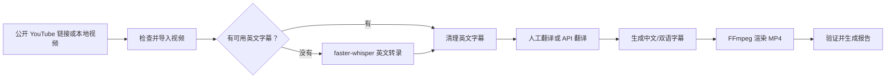

# YouTube Chinese Localization Pipeline 中文使用说明书

本说明书面向希望在 Windows 10/11 上将英文视频制作成简体中文本地化版本的普通用户。

项目地址：

<https://github.com/lujiangyancheng-jpg/youtube-chinese-localization-pipeline>

## 1. 软件能做什么

输入一个公开的 YouTube 视频链接或本地视频文件，软件可以生成：

- 原始视频的安全副本或公开 YouTube 视频下载文件
- 规范化的英文 SRT 字幕
- 简体中文 SRT 字幕
- 可选的中英双语字幕
- 带硬字幕的 MP4 视频
- 字幕预览片段
- 标题、简介和标签草稿
- 可恢复的项目目录、日志和处理报告

处理流程如下：



## 2. 使用前必须确认

只能处理以下内容：

- 你自己拥有的视频
- 公共领域内容
- 许可范围允许翻译和转载的 Creative Commons 内容
- 已取得明确翻译和再发布许可的内容

本软件不会绕过 DRM、付费墙、私人视频权限、年龄限制、地区验证或平台登录控制。

发布前请自行核实：

- 授权是否允许翻译、修改和重新发布
- 是否需要署名原作者
- 是否允许商业用途
- 发布平台是否有额外规则

## 3. Windows 快速安装

### 3.1 安装 Git

如果电脑尚未安装 Git：

```powershell
winget install Git.Git
```

安装完成后重新打开 PowerShell。

### 3.2 下载项目

```powershell
git clone https://github.com/lujiangyancheng-jpg/youtube-chinese-localization-pipeline.git
cd youtube-chinese-localization-pipeline
```

### 3.3 安装 Python

建议使用 Python 3.11、3.12 或 3.13。安装时勾选“Add Python to PATH”。

可以使用：

```powershell
winget install Python.Python.3.12
```

### 3.4 安装 FFmpeg

```powershell
winget install Gyan.FFmpeg
```

安装后关闭并重新打开 PowerShell，然后检查：

```powershell
ffmpeg -version
ffprobe -version
```

FFmpeg 必须包含 `ass`/`subtitles`（libass）字幕滤镜。

如果不希望加入系统 PATH，也可以把 FFmpeg 放在：

```text
项目目录\tools\ffmpeg\bin\ffmpeg.exe
项目目录\tools\ffmpeg\bin\ffprobe.exe
```

### 3.5 创建 Python 虚拟环境

```powershell
py -3.12 -m venv .venv
.\.venv\Scripts\Activate.ps1
python -m pip install --upgrade pip
python -m pip install -e ".[transcription]"
```

如果只处理已经带英文字幕的视频，不需要 Whisper：

```powershell
python -m pip install -e .
```

### 3.6 检查环境

```powershell
python main.py doctor
```

理想结果：

- Python：`ok`
- FFmpeg：`ok`
- ffprobe：`ok`
- yt-dlp：`ok`
- faster-whisper：`ok` 或 `optional`
- 输出目录：`ok`
- 中文字体：`ok` 或可接受的警告

### 3.7 双击打开“粘贴链接”界面

安装和环境检查完成后，在项目目录中双击：

```text
Start Localizer.cmd
```

打开窗口后：

1. 复制并粘贴一个你有权处理的公开 YouTube 视频链接，也可以选择本地视频。
2. 选择仅中文字幕或中英双语字幕。
3. 选择翻译方式并确认授权。
4. 点击“开始本地化”。

窗口会实时显示下载、字幕提取或 Whisper 转录、翻译和视频压制进度。点击“打开输出文件夹”可以查看处理项目，最终中文字幕视频位于：

```text
output\项目名称\rendered\chinese_hardsub.mp4
```

翻译方式说明：

- “免费模式”不需要 API，会自动完成视频下载和英文字幕，然后停在人工翻译步骤。
- “自动翻译并压制字幕”会继续生成中文并压制最终视频，但必须填写 OpenAI-compatible 接口地址、模型名称和 API Key。
- 在窗口中输入的 API Key 只传给处理进程，不会保存到项目或上传到 GitHub。接口地址和模型名称可能写入本地项目的已解析配置，以便中断后继续处理。

ChatGPT Plus 不能直接作为本地程序的 API 使用，也不包含 OpenAI API 额度。

## 4. 第一次处理本地视频

先用一段你拥有版权的短视频测试：

```powershell
python main.py process "D:\Videos\owned-demo.mp4"
```

也可以省略 `process`：

```powershell
python main.py "D:\Videos\owned-demo.mp4"
```

默认使用不需要 API Key 的人工翻译模式。第一次运行通常会：

1. 检查并复制视频
2. 查找英文字幕
3. 没有字幕时调用 faster-whisper 转录
4. 清理英文字幕
5. 导出人工翻译分块
6. 显示项目目录并等待翻译导入

请不要关闭或删除生成的项目目录。后续步骤会继续使用该目录。

## 5. 人工 ChatGPT 翻译流程

这是默认并且不产生 API 费用的流程。

> ChatGPT Plus 与 OpenAI API 是两项独立服务。ChatGPT Plus 不包含 OpenAI API 额度。

### 5.1 找到翻译分块

程序会生成类似目录：

```text
output\Owned demo_a1b2c3d4e5\
  subtitles\
    english.cleaned.srt
    translation_chunks\
      chunk_001.md
      chunk_002.md
      manifest.json
```

### 5.2 在 ChatGPT 中翻译

逐个上传 `chunk_001.md`、`chunk_002.md`。

文件已经包含翻译规则。ChatGPT 应返回 JSONL，每一行类似：

```json
{"id":1,"start":"00:00:01,000","end":"00:00:03,000","en":"Hello everyone","zh":"大家好"}
```

请保存每次返回的内容，例如：

```text
D:\Translations\translated_chunk_001.txt
D:\Translations\translated_chunk_002.txt
```

不要修改：

- `id`
- `start`
- `end`
- `en`

只填写 `zh`。

### 5.3 导入翻译

```powershell
python main.py translate-import "output\Owned demo_a1b2c3d4e5" "D:\Translations\translated_chunk_001.txt"
python main.py translate-import "output\Owned demo_a1b2c3d4e5" "D:\Translations\translated_chunk_002.txt"
```

每次导入都会显示：

```text
Imported translations: 已导入数量/总字幕数量
```

全部完成后会生成：

```text
subtitles\chinese.srt
subtitles\chinese.ass
```

### 5.4 渲染最终视频

```powershell
python main.py render "output\Owned demo_a1b2c3d4e5"
```

最终文件：

```text
rendered\chinese_hardsub.mp4
```

### 5.5 验证输出

```powershell
python main.py validate "output\Owned demo_a1b2c3d4e5"
```

验证会检查：

- 字幕编号和时间是否合法
- 视频流是否存在
- 音频流是否存在
- 输出时长是否接近源视频
- 视频是否可以解码

## 6. 处理公开 YouTube 视频

确认你有权翻译和再发布后运行：

```powershell
python main.py process "https://www.youtube.com/watch?v=VIDEO_ID"
```

字幕优先顺序：

1. 作者上传的英文字幕
2. 作者上传的 `en-US`、`en-GB` 等英文变体
3. YouTube 自动生成的英文字幕
4. 本地 faster-whisper 转录

以下内容会被拒绝或无法处理：

- 私人视频
- 需要账号权限的视频
- 年龄限制视频
- DRM 内容
- 正在直播的内容
- 非 YouTube 的远程 URL

本软件不会读取浏览器 Cookie，也不会绕过平台限制。

## 7. 使用 OpenAI-compatible API 自动翻译

只有希望单命令完成翻译时才需要配置 API。

### 7.1 设置环境变量

PowerShell 临时设置：

```powershell
$env:OPENAI_COMPATIBLE_API_KEY = "你的 API Key"
$env:OPENAI_COMPATIBLE_ENDPOINT = "https://api.openai.com/v1"
$env:OPENAI_COMPATIBLE_MODEL = "你的模型名称"
```

也可以复制示例文件：

```powershell
Copy-Item .env.example .env
```

然后在 `.env` 中填写真实信息。

`.env` 已被 Git 忽略，不要把 API Key 写入 README、配置示例或提交到 GitHub。

### 7.2 自动处理

```powershell
python main.py process "D:\Videos\owned-demo.mp4" --translation-provider openai-compatible
```

成功的翻译响应会缓存在项目 `temp\translation_cache` 中。输入、模型和上下文未变化时，不会重复同一付费请求。

如果出现限流或临时服务错误，程序会自动重试。永久错误会写入处理报告。

## 8. 生成双语字幕

英文在上、中文在下：

```powershell
python main.py process "D:\Videos\owned-demo.mp4" --subtitle-mode bilingual_en_zh
```

中文在上、英文在下：

```powershell
python main.py process "D:\Videos\owned-demo.mp4" --subtitle-mode bilingual_zh_en
```

仅中文：

```powershell
python main.py process "D:\Videos\owned-demo.mp4" --subtitle-mode chinese
```

双语模式会生成：

```text
subtitles\bilingual.srt
subtitles\bilingual.ass
```

## 9. 先预览字幕样式

在渲染整个视频前，可以先生成 15 秒预览：

```powershell
python main.py preview "output\PROJECT_NAME" --start 60 --duration 15
```

输出示例：

```text
rendered\preview_60_15.mp4
```

如果字体、字号或位置不合适，修改配置后重新预览。

## 10. 配置文件

复制配置示例：

```powershell
Copy-Item config.example.yaml config.local.yaml
```

使用配置：

```powershell
python main.py process "D:\Videos\owned-demo.mp4" --config config.local.yaml
```

常用设置：

```yaml
output_directory: output
subtitle_mode: chinese

transcription:
  model: medium
  device: auto
  compute_type: auto

translation:
  provider: manual
  batch_size: 40

subtitles:
  font: Microsoft YaHei
  font_size: 48
  outline: 3
  shadow: 1
  margin_v: 45
  max_chinese_chars_per_line: 20

render:
  codec: libx264
  crf: 18
  preset: medium
```

### 字幕字体

Windows 推荐：

- Microsoft YaHei
- SimHei
- Noto Sans CJK SC

软件不附带商业字体文件。配置的字体必须已经安装在系统中。

### Whisper 模型

- CPU：建议 `small` 或 `medium`
- NVIDIA GPU：显存足够时可以使用 `large-v3`
- `device: auto`：自动检测 CUDA，否则使用 CPU
- CPU 默认计算类型：`int8`
- CUDA 默认计算类型：`float16`

首次使用某个 Whisper 模型时需要联网下载模型文件。

### 视频质量

`crf` 越小，画质越高、文件越大：

- `18`：高质量默认值
- `20` 到 `23`：较小文件
- 不建议无必要设置得低于 `16`

## 11. 中断后继续处理

继续同一个输入：

```powershell
python main.py process "D:\Videos\owned-demo.mp4" --resume
```

软件会检查：

- 输入文件哈希
- 相关配置哈希
- 已生成文件是否仍然存在
- 之前步骤是否成功

匹配时会跳过已完成步骤。

如果英文字幕发生变化，旧中文字幕、人工翻译缓存和渲染视频会被自动判定为过期，避免混用新旧内容。

强制重做某一步：

```powershell
python main.py process "D:\Videos\owned-demo.mp4" --resume --force-step transcribe
python main.py process "D:\Videos\owned-demo.mp4" --resume --force-step translate
python main.py process "D:\Videos\owned-demo.mp4" --resume --force-step render
```

覆盖整个同名项目：

```powershell
python main.py process "D:\Videos\owned-demo.mp4" --overwrite
```

`--overwrite` 会替换精确匹配的项目目录，请谨慎使用。

## 12. 项目目录说明

```text
output\
  sanitized_title_videoid\
    source\
      source_video.mp4
      metadata.json
      metadata.raw.json
      thumbnail.jpg
    subtitles\
      source.en.vtt
      english.cleaned.srt
      chinese.srt
      chinese.ass
      bilingual.srt
      bilingual.ass
      transcription.raw.json
      translation_chunks\
    audio\
      transcription_audio.wav
    rendered\
      chinese_hardsub.mp4
      preview_60_15.mp4
    publishing\
      title.txt
      description.txt
      tags.txt
      metadata_localized.json
    logs\
      pipeline.log
      report.json
      report.md
    temp\
    config.resolved.json
    pipeline_state.json
```

重要文件：

- `source\metadata.json`：规范化的源视频信息
- `english.cleaned.srt`：翻译所用英文字幕
- `chinese.srt`：最终简体中文字幕
- `pipeline_state.json`：断点续跑状态
- `logs\report.md`：供用户阅读的处理报告
- `logs\report.json`：机器可读报告

## 13. 常用命令速查

| 任务 | 命令 |
|---|---|
| 检查环境 | `python main.py doctor` |
| 处理一个输入 | `python main.py process INPUT` |
| 简写处理 | `python main.py INPUT` |
| 批量处理 | `python main.py --batch inputs.txt` |
| 查看项目状态 | `python main.py inspect PROJECT_PATH` |
| 强制 Whisper 转录 | `python main.py transcribe PROJECT_PATH` |
| 导出人工翻译 | `python main.py translate-export PROJECT_PATH` |
| 导入翻译结果 | `python main.py translate-import PROJECT_PATH FILE` |
| 运行配置的翻译提供方 | `python main.py translate PROJECT_PATH` |
| 生成预览 | `python main.py preview PROJECT_PATH` |
| 渲染最终视频 | `python main.py render PROJECT_PATH` |
| 生成发布信息草稿 | `python main.py metadata PROJECT_PATH` |
| 验证字幕和视频 | `python main.py validate PROJECT_PATH` |
| 清理临时缓存 | `python main.py clean PROJECT_PATH` |

含空格的路径必须放在双引号中。

## 14. 批量处理

创建 UTF-8 文本文件 `inputs.txt`：

```text
# 每行一个输入，井号开头为注释
D:\Videos\video-one.mp4
D:\Videos\video-two.mp4
https://www.youtube.com/watch?v=VIDEO_ID
```

运行：

```powershell
python main.py --batch inputs.txt
```

批处理按顺序执行。某个输入失败时会记录错误并继续处理其他输入。

## 15. 清理临时文件

```powershell
python main.py clean "output\PROJECT_NAME"
```

该命令只删除：

- `temp` 中的缓存
- `.partial` 临时文件

不会删除：

- 源视频副本
- 英文或中文字幕
- 最终渲染视频
- 日志和报告

跳过确认提示：

```powershell
python main.py clean "output\PROJECT_NAME" --yes
```

## 16. 常见问题

### 找不到 `ffmpeg` 或 `ffprobe`

```powershell
winget install Gyan.FFmpeg
```

重新打开 PowerShell，再运行：

```powershell
python main.py doctor
```

### FFmpeg 提示没有 `ass` 或 `subtitles` 滤镜

当前 FFmpeg 构建没有 libass。请安装包含 libass 的完整 FFmpeg 构建。

### faster-whisper 无法安装

优先使用 Python 3.11、3.12 或 3.13 创建新虚拟环境：

```powershell
py -3.12 -m venv .venv
.\.venv\Scripts\Activate.ps1
python -m pip install -e ".[transcription]"
```

### Whisper 显存不足

修改配置：

```yaml
transcription:
  model: small
  device: cpu
  compute_type: int8
```

### 人工翻译文件无法导入

确认：

- 返回内容是 JSONL
- 每行是一个完整 JSON 对象
- `id`、`start`、`end` 和 `en` 未改变
- 每个 `zh` 都有内容
- URL 没有被修改或删除

必要时重新导出原始分块：

```powershell
python main.py translate-export "output\PROJECT_NAME"
```

### 提示项目已经存在

继续处理：

```powershell
python main.py process INPUT --resume
```

确认要重新创建时：

```powershell
python main.py process INPUT --overwrite
```

### YouTube 下载失败

检查：

- URL 是否是单个公开视频
- 视频是否仍然可用
- 是否存在年龄、地区或账号限制
- yt-dlp 是否为最新版本

更新 yt-dlp：

```powershell
python -m pip install --upgrade yt-dlp
```

软件不会通过 Cookie 或其他方式绕过访问限制。

### 中文显示为方框

将配置中的字体改为系统已安装的中文字体：

```yaml
subtitles:
  font: Microsoft YaHei
```

然后重新生成预览或渲染。

## 17. 日志与错误报告

发生错误时先查看：

```text
PROJECT_PATH\logs\report.md
PROJECT_PATH\logs\pipeline.log
```

报告包含：

- 源视频信息
- 字幕来源
- Whisper 模型
- 翻译提供方
- 字幕数量和需人工检查的字幕编号
- 各阶段耗时
- 输出路径
- 警告和错误

向项目维护者报告问题时，请提供：

- 操作系统和 Python 版本
- `python main.py doctor` 输出
- 执行的命令
- `report.md` 中的错误内容

不要公开上传：

- `.env`
- API Key
- 未授权视频
- 含个人敏感信息的完整日志

## 18. 已知限制

- YouTube 支持情况取决于当前 yt-dlp 版本和平台变化
- 不支持私人、付费、DRM 或需要登录验证的视频
- 专有名词、笑话和小众术语仍需人工校对
- 发布标题和许可文字必须由用户最终确认
- 当前版本不自动上传视频到发布平台
- 当前版本不自动进行高级字幕重定时
- 首次下载 Whisper 模型需要网络和额外磁盘空间

## 19. 推荐的首次测试顺序

1. 安装 Python、FFmpeg 和项目依赖
2. 运行 `python main.py doctor`
3. 用 30 秒到 2 分钟的自有本地视频测试
4. 完成人工翻译导入
5. 渲染 15 秒预览
6. 检查字体、断句和同步
7. 渲染完整视频
8. 运行 `validate`
9. 人工检查标题、描述、署名和许可证信息
10. 确认授权后再发布
